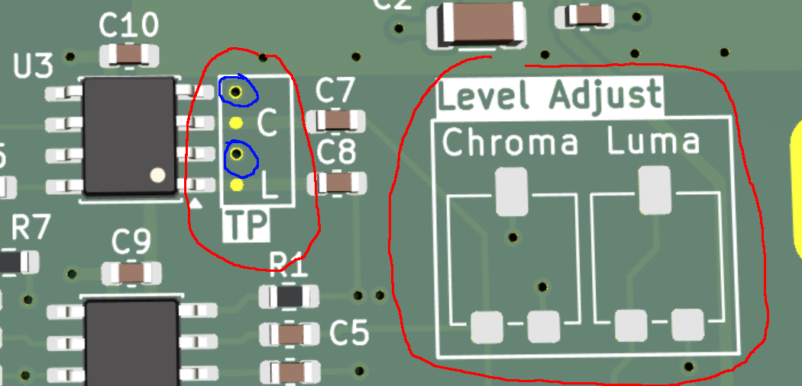

# C64 RF Modulator Replacement
## Introduction
This is yet another C64 RF Modulator replacement. Strictly seen, it doesn't fully replace the RF modulation (used to connect to the antenna input of old CRT TV sets) but addresses some well known
issues of the existing RF modulator with respect to generation of the Luma and Chroma signals for S-Video related to signal quality and levels.

## Features
- S-Video Mini-DIN connector at physical location of the legcy RF Cinch connector
- Separate processing of S-Video (Luma/Chroma) for S-Video connector and C64 on-board DIN video connector
- Composite Video signal generation for C64 video connector
- 4 layer PCB design to ensure high signal integrity

## Design
The [schematic](schematic.pdf) shows the 4 different blocks used in the design:
- **Power section:**
Generates a clean 3.3V supply using an LDO out of the 5V system supply
- **C64 Interface & Input Divider stage:**
Incoming Luma and Chroma signals are open drain and open source signals, respectively. The input stage adds needed pull-up/down resistor network along with some
triming resistors to configure the proper input levels
- **Video Amplifier S-Video:**
The input signals are amplified/buffers by a THS-7314 video amplifier with a gain of 6dB. This 6dB compensates for the 6dB drop at the receiving device due to the 75 Ohms serial and end termination which means, the input signal at THS-7314 has the same level as the input signal of the receiving device. Note that THS-7314 has an internal bias circuitry which allows AC coupling of the input signal using 100nF capcitors C7 and C8. The output is DC coupled as the design intentionally avoids AC coupling capacitors which would be quite large for a 75 Ohms line. It is
known practice that AC coupling typically happens at the input stage of the receiving device.
- **Video Amplifier C64 Interface:**
This stage is similar to the S-Video stage but in addition it generates the Composite Video for the C64 Video connector. In case this is not needed, R3, R4, R7 and C6 can be left out.

## Triming Procedure
Two testpoints are available at the input of video amplifier U3: 

The testpoint labeled C exposes the Chroma signal and L the Luma signal. Next two these two testpoints there are vias (blue circled) with removed solder mask which can be used for low-inductive probing. Power up the C64 without a screen connected. Connect a scope to the testpoints and use the corresponding Luma and Chroma trimmer (right in the picture) to adjust the required signal levels:
- **Chroma:** 0.3Vpp
- **Luma:** 1Vpp
